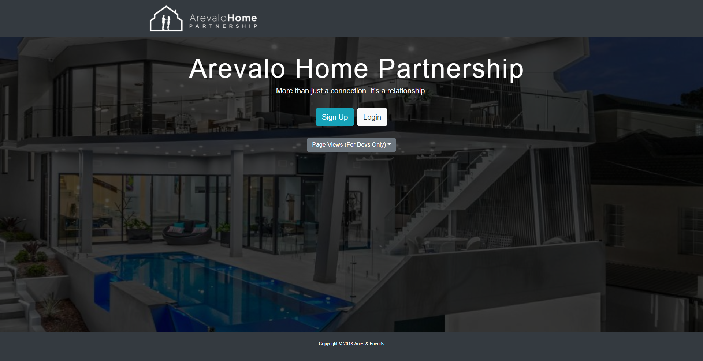
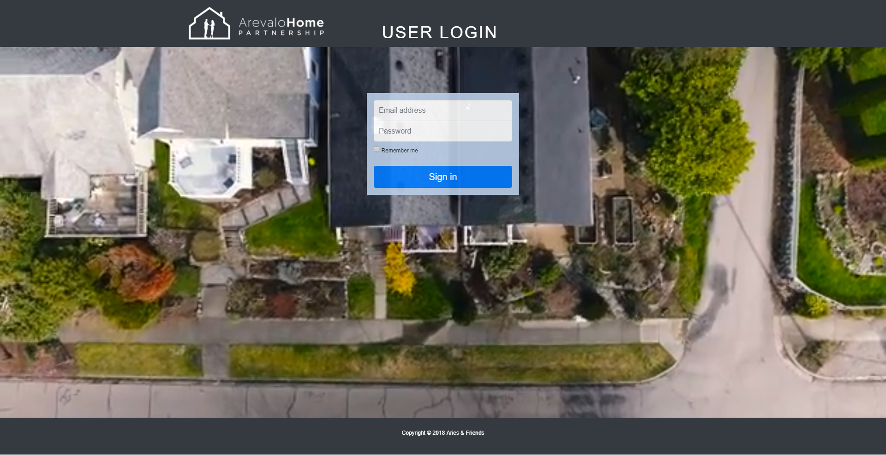
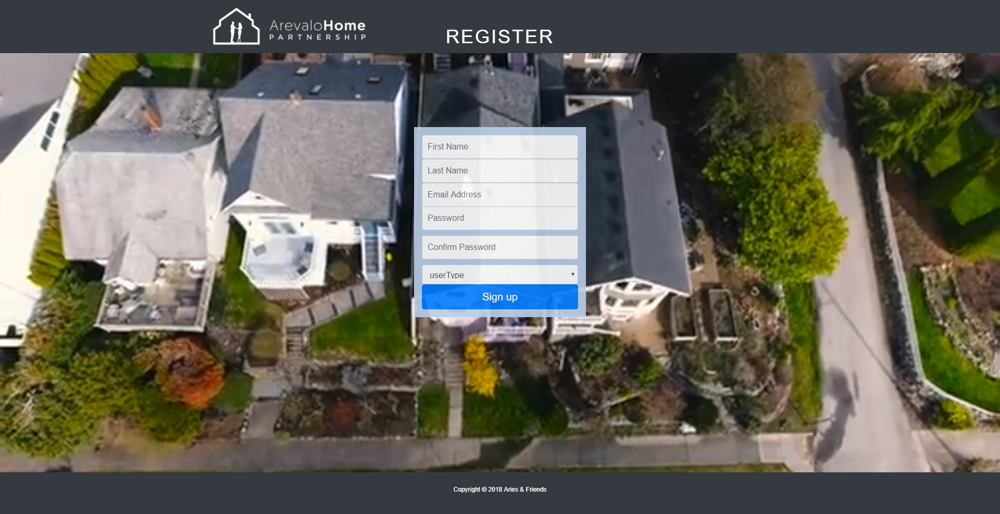
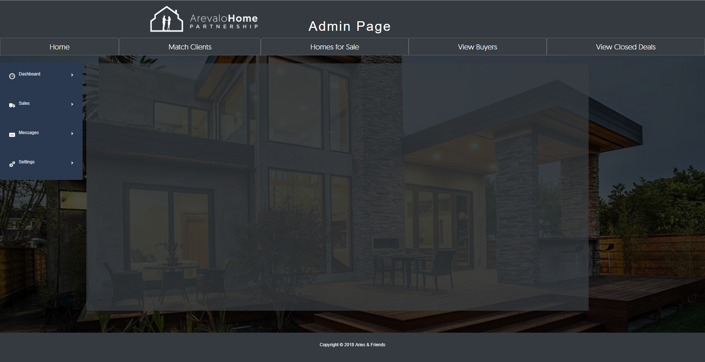
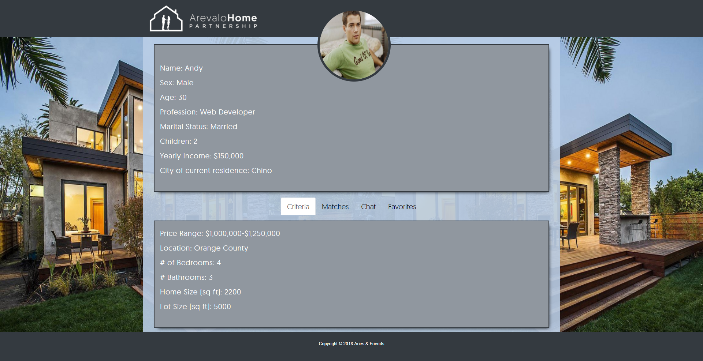
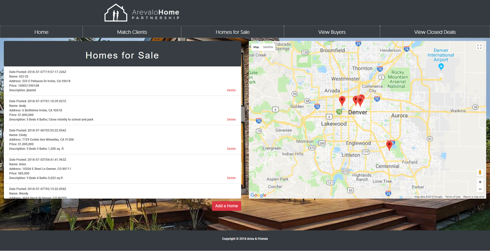
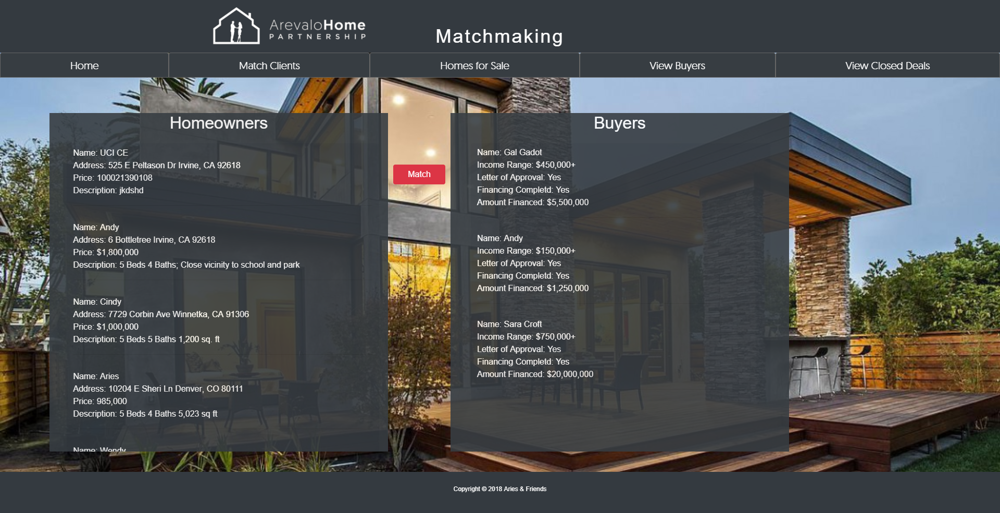

<h1>rea-sales-client</h1>

<h3>Real-Estate Lead Generator Web Site created with the following:</h3>

<ul><h4>CLIENT-SIDE</h4>
   <li> React-CRUD-Table
   <li> React - DOM
   <li> React-Geocode
   <li> React-Google-Maps
   <li> React-Router
   <li> React-Router-DOM
   <li> React-Scripts
   <li> Redux
    </ul>

<ul><h4>SERVER-SIDE</h4>
   <li> Axios
   <li> Bcrypt
   <li> Body-Parser
   <li> Dotenv
   <li> JSON Web Token
   <li> Mongoose
   <li> Multer
   <li> Passport
   <li> Pasport-jst
   <li> Validator
       </ul>
       
   <h3>Images showcasing app can be seen below</h3>
   
   
   
   
   
   
   
   

